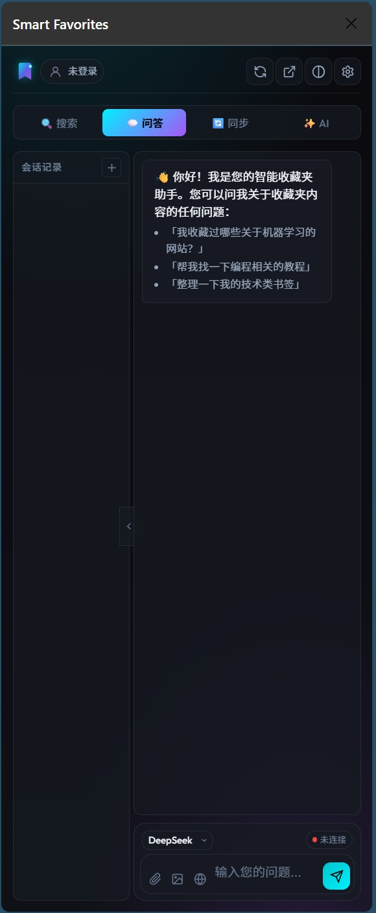
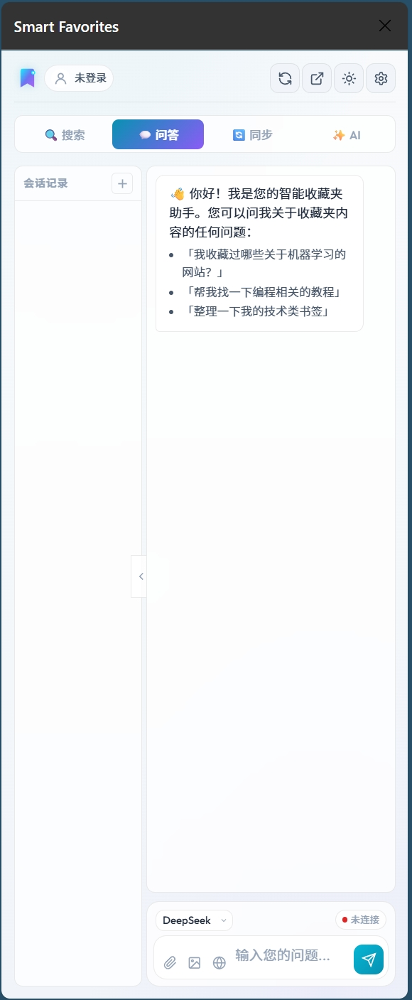

<a href="README.md">🌐 中文</a> | <a >🌐 English</a>
# Smart Favorites
[](https://github.com/awezio/Smart-Favorites/stargazers)
[](https://github.com/awezio/Smart-Favorites/issues)
[](LICENSE)


<p align="center">
  
</p>

<p align="center">
  <strong>AI-Powered Browser Bookmark Intelligent Management System</strong><br>
  Supports semantic search, RAG Q&A, intelligent categorization, chat history persistence, and multi-model switching
</p>

<p align="center">
  <strong>Web app + browser extension</strong>: Deploy the <a href="smart-favorites-web/QUICK_START.md">Web app</a> (Next.js + Supabase / Vercel) first; the extension connects to the Web API by default. You can also self-host the <code>backend/</code> if needed.
</p>

---

## ✨ v2.0 New Features

- **Web App**: Standalone Next.js app, deployable to Vercel without running a local backend
- **Supabase Backend**: Bookmarks and GitHub Stars with PostgreSQL + pgvector for vector search
- **GitHub Stars Support**: Manage GitHub starred repos with unified search and AI Q&A
- **Extension uses Web by default**: Browser extension connects to the Web app API for cloud sync

## ✨ v1.1 New Features

- **Sidebar Mode**: The extension opens as a sidebar, no longer blocking page content.
- **Dual Theme System**: Supports dark mode (Cyber Teal), light mode (Ocean Teal), and auto-follow system.
- **Chat History Persistence**: Conversation history is saved to a local database and automatically restored upon restart.
- **Session Management**: Supports creating, renaming, and deleting multiple conversation sessions.
- **Integrated Settings Panel**: Configure backend and API keys directly within the sidebar.
- **API Key Encrypted Storage**: Sensitive information is encrypted using Fernet and stored on the backend.
- **Independent Window Mode**: Detach the sidebar as a standalone browser window.
- **Toolbar Enhancement**: Added refresh connection, independent window, and theme toggle buttons.

## 🎯 Features

### Core Features

<table style="width:100%">
  <tr>
    <th style="width:20%">Feature</th>
    <th style="width:80%">Description</th>
  </tr>
  <tr>
    <td>🔍 <b>Semantic Search</b></td>
    <td>Intelligent semantic retrieval using a vector database, not just keyword matching.</td>
  </tr>
  <tr>
    <td>💬 <b>AI Q&A</b></td>
    <td>Ask questions about your bookmarks in natural language based on RAG technology.</td>
  </tr>
  <tr>
    <td>📝 <b>Chat History</b></td>
    <td>Conversation history is automatically saved, supporting multi-session management.</td>
  </tr>
  <tr>
    <td>🔄 <b>Auto Sync</b></td>
    <td>Directly reads browser bookmarks, supports automatic/scheduled/manual synchronization.</td>
  </tr>
  <tr>
    <td>🤖 <b>Multi-Model Support</b></td>
    <td>Adapts to OpenAI, DeepSeek, Kimi, Qwen, Claude, Gemini, GLM, Ollama.</td>
  </tr>
</table>

### Intelligent Tools

<table style="width:100%">
  <tr>
    <th style="width:20%">Feature</th>
    <th style="width:80%">Description</th>
  </tr>
  <tr>
    <td>🏷️ <b>Intelligent Categorization</b></td>
    <td>AI analyzes bookmark content and suggests more reasonable categorization methods.</td>
  </tr>
  <tr>
    <td>🔍 <b>Duplicate Detection</b></td>
    <td>Automatically detects duplicate or similar bookmarks and provides consolidation suggestions.</td>
  </tr>
  <tr>
    <td>✅ <b>User Confirmation</b></td>
    <td>All AI suggestions require manual user confirmation before execution.</td>
  </tr>
</table>

### Interface Features

<table style="width:100%">
  <tr>
    <th style="width:20%">Feature</th>
    <th style="width:80%">Description</th>
  </tr>
  <tr>
    <td>🌙 <b>Dual Theme</b></td>
    <td>Dark/Light mode toggle, supports following system settings</td>
  </tr>
  <tr>
    <td>📱 <b>Sidebar</b></td>
    <td>Does not block page content, always accessible</td>
  </tr>
  <tr>
    <td>🪟 <b>Independent Window</b></td>
    <td>Can be detached as a standalone window</td>
  </tr>
  <tr>
    <td>⚙️ <b>Integrated Settings</b></td>
    <td>Configure directly within the extension, no need to open a new page</td>
  </tr>
</table>

## 🖼️ Screenshots Preview

<p align="center">
  
  
</p>

## 🚀 Quick Start

### 1. Deploy the Web app

1. Go to the `smart-favorites-web` directory
2. Follow [smart-favorites-web/QUICK_START.md](smart-favorites-web/QUICK_START.md) to set up Supabase (tables, env vars) and deploy to Vercel
3. Get your Web app URL (e.g. `https://xxx.vercel.app`)

### 2. Install the browser extension and connect to the Web app

1. Open Edge or Chrome and go to `edge://extensions/` or `chrome://extensions/`
2. Enable **Developer mode**, click **Load unpacked**, and select the project’s `extension` directory (or download from [Releases](https://github.com/yourusername/smart-favorites/releases), extract, then load)
3. In the extension sidebar, open **Settings**, set the backend URL to your Web app URL (e.g. `https://xxx.vercel.app`), save and refresh the connection

### 3. Start using

Use the sidebar to sync bookmarks, run semantic search, AI Q&A, and smart categorization; data is stored on the Web app.

---

**Optional: Local backend**  
To run a backend locally (without Vercel/Supabase), you can self-host `backend/` — see `backend/README.md`. Point the extension’s backend URL to `http://localhost:8000`.

## 📁 Project Structure

```
Smart Favorites/
├── backend/                       # Local Python backend (optional, for self-hosting)
│   ├── app/
│   │   ├── api/                  # FastAPI routes
│   │   │   └── routes.py         # API endpoint definition
│   │   ├── config/               # Configuration management
│   │   ├── models/               # Data model
│   │   │   ├── api_models.py     # API request/response model
│   │   │   ├── bookmark.py       # Bookmark model
│   │   │   ├── chat.py           # Chat session model
│   │   │   └── config.py         # Configure the model
│   │   └── services/             # Core Services
│   │       ├── bookmark_parser.py    # Bookmark parsing
│   │       ├── vector_store.py       # ChromaDB vector store
│   │       ├── llm_adapter.py        # Multiple LLM Adapters
│   │       ├── rag_engine.py         # Retrieval-Augmented Generation
│   │       ├── ai_analyzer.py        # AI Analytics Service
│   │       ├── chat_storage.py       # Chat history storage
│   │       └── config_manager.py     # Configuration and Key Management
│   ├── data/                     # Data Catalog (Automatically Created)
│   │   ├── chroma/               # Vector database
│   │   ├── chat_history.db       # Chat history
│   │   └── config.db             # Encryption configuration
│   ├── requirements.txt          # Python dependencies
│   ├── env.example              # Environment variable example
│   └── run.py                   # Start script
│
├── extension/                     # Browser extension (Manifest V3)
│   ├── manifest.json             # Plugin Configuration
│   ├── sidepanel/               # Sidebar interface
│   │   ├── sidepanel.html       # Main interface
│   │   ├── sidepanel.css        # Style (including dual theme)
│   │   └── sidepanel.js         # Interaction logic
│   ├── background/              # Service Worker
│   │   └── background.js        # Background service
│   ├── options/                 # Settings page
│   └── icons/                   # Icon resources
│
├── smart-favorites-web/          # Web app (Next.js 15 + Supabase)
│   ├── app/                     # Next.js App Router pages & API
│   ├── components/              # React components
│   ├── supabase/                # Migrations & types
│   │   └── migrations/          # DB schema & vector search functions
│   ├── QUICK_START.md           # Web quick start guide
│   └── package.json
│
├── .gitignore                    # Git ignore configuration
├── LICENSE                       # Apache 2.0 license
├── README.md                     # Project readme (Chinese)
└── README-EN.md                  # Project readme (English)
```

## 🔌 API Interfaces

The following describe the **local backend** (`backend/`) API. When using the Web app, refer to the Web app’s routes and documentation.

### Health Check

```http
GET /health
```

### Connection Status

```http
GET /api/status
```

Response Example:

```json
{
  "status": "connected",
  "model": "deepseek-chat",
  "provider": "deepseek",
  "bookmark_count": 256
}
```

### Sync Favorites

```http
POST /api/bookmarks/sync
Content-Type: application/json

{
  "html_content": "<书签 HTML 内容>",
  "replace_existing": true
}
```

### Semantic Search

```http
POST /api/search
Content-Type: application/json

{
  "query": "机器学习教程",
  "top_k": 10
}
```

### AI Q&A

```http
POST /api/chat
Content-Type: application/json

{
  "message": "我收藏了哪些关于 Python 的网站？",
  "session_id": "会话ID",
  "include_sources": true
}
```

### Session Management

```http
# Get all sessions
GET /api/chat/sessions

# Create a new session
POST /api/chat/sessions
{ "title": "新会话" }

# Get session details (including messages)
GET /api/chat/sessions/{session_id}

# Update session
PATCH /api/chat/sessions/{session_id}
{ "title": "新标题" }

# Delete session
DELETE /api/chat/sessions/{session_id}
```

### Settings Management

```http
# Get current settings
GET /api/settings

# Set default service provider
POST /api/settings/provider
{ "provider": "deepseek" }

# Set API key (encrypted storage)
POST /api/settings/apikey
{ "provider": "deepseek", "api_key": "sk-xxx" }
```

### AI Smart Tools

```http
# Intelligent categorization
POST /api/ai/categorize

# Duplicate detection
POST /api/ai/duplicates
```

Complete API documentation is available at: **http://localhost:8000/docs**

## 🤖 Supported AI Models

<table style="width:100%">
  <tr>
    <th style="width:20%">Provider</th>
    <th style="width:30%">Model</th>
    <th style="width:50%">Description</th>
  </tr>
  <tr>
    <td><b>DeepSeek</b></td>
    <td>deepseek-chat</td>
    <td>⭐ Recommended, available in China, cost-effective</td>
  </tr>
  <tr>
    <td>OpenAI</td>
    <td>gpt-5.2</td>
    <td>Requires API Key, may need a proxy</td>
  </tr>
  <tr>
    <td>Kimi</td>
    <td>moonshot-2.5</td>
    <td>Moonshot AI, supports long context</td>
  </tr>
  <tr>
    <td>Qwen</td>
    <td>qwen-3</td>
    <td>Alibaba Tongyi Qianwen</td>
  </tr>
  <tr>
    <td>Claude</td>
    <td>claude 4.5 sonnet, opus 4.6</td>
    <td>Anthropic</td>
  </tr>
  <tr>
    <td>Gemini</td>
    <td>gemini 3.1 pro</td>
    <td>Google</td>
  </tr>
  <tr>
    <td>GLM</td>
    <td>glm-4.7, glm-5</td>
    <td>Zhipu AI</td>
  </tr>
  <tr>
    <td>Ollama</td>
    <td>llama3, mistral, etc.</td>
    <td>Local deployment, no API Key required</td>
  </tr>
</table>

## 🛠️ Tech Stack

### Web app (smart-favorites-web)

- **Next.js 15** - React full-stack framework (App Router)
- **Supabase** - PostgreSQL + pgvector for search, auth, and storage
- **Vercel** - Frontend and serverless deployment
- **Tailwind CSS / shadcn/ui** - Styling and components

### Local backend (optional, for self-hosting)

- **FastAPI** - High-performance asynchronous Python web framework
- **ChromaDB** - Vector database for semantic search
- **Sentence Transformers** - Local Embedding model (paraphrase-multilingual-MiniLM-L12-v2)
- **SQLite** - Chat history and configuration storage
- **Cryptography (Fernet)** - API key encryption
- **Multi-LLM SDK** - Official SDKs for OpenAI, Anthropic, Google, etc.

### Frontend/Plugin

- **Manifest V3** - Modern browser extension standard
- **Side Panel API** - Chrome/Edge side panel functionality
- **Native JavaScript** - Lightweight with no dependencies
- **CSS Variables** - Supports theme switching
- **Chrome Storage API** - Local settings storage

## 📋 Development Plan

- [x] Favorites HTML parsing
- [x] ChromaDB vector storage
- [x] RAG (Retrieval-Augmented Generation)
- [x] Multi-LLM adapter
- [x] FastAPI backend
- [x] Edge/Chrome browser extension
- [x] Direct browser favorites reading
- [x] Automatic/scheduled synchronization
- [x] AI bookmark categorization suggestions
- [x] AI duplicate bookmark detection
- [x] Side panel mode (v1.1)
- [x] Dark/light theme switching (v1.1)
- [x] Chat history persistence (v1.1)
- [x] Session management (v1.1)
- [x] API key encrypted storage (v1.1)
- [x] Integrated settings panel (v1.1)
- [x] Web app Next.js + Supabase (v2.0)
- [x] GitHub Stars management & unified search (v2.0)
- [x] Vercel deployment & extension connecting to web API (v2.0)
- [ ] Dead link detection
- [ ] Automatic bookmark tagging
- [ ] Multi-language support
- [ ] User login system

## 🤝 Contribution Guidelines

Welcome to submit Issues and Pull Requests!

1. Fork this repository
2. Create a feature branch (`git checkout -b feature/amazing-feature`)
3. Commit your changes (`git commit -m 'Add amazing feature'`)
4. Push to the branch (`git push origin feature/amazing-feature`)
5. Create a Pull Request

## ❓ Troubleshooting

### Common Issues

**Q: Backend startup reports "Remote host forced connection closure"**

A: This is a network issue when downloading the Embedding model. Solutions:

- Use a proxy or mirror source
- Manually download the model to `~/.cache/torch/sentence_transformers/`
- Refer to `backend/TROUBLESHOOTING.md`

**Q: Extension cannot connect to the backend**

A: Check the following:

- Is the backend service running? (http://localhost:8000)
- Are there any CORS errors in the browser console?
- Is the connection blocked by a firewall?

**Q: Side panel cannot be opened**

A: Ensure you are using a browser version that supports the Side Panel API:

- Edge 114+
- Chrome 114+

**Q: Chat history is not saved**

A: Ensure:

- The backend service is running
- The session ID is valid (not a local session starting with `local-`)
- Check the backend logs for errors

**Q: API key does not take effect after saving**

A:

- Click the refresh button to reconnect after saving
- Check the backend logs to confirm the key was saved correctly
- Ensure the correct default service provider is selected

## 📄 License

This project is licensed under the [Apache License 2.0](LICENSE).

## 🙏 Acknowledgments

- [ChromaDB](https://www.trychroma.com/) - Vector Database
- [FastAPI](https://fastapi.tiangolo.com/) - Web Framework
- [Sentence Transformers](https://www.sbert.net/) - Embedding Model
- [Lucide Icons](https://lucide.dev/) - Icon Library

---

<p align="center">
  <strong>Smart Favorites</strong> - Make Your Bookmarks Smarter 🔖✨
</p>
